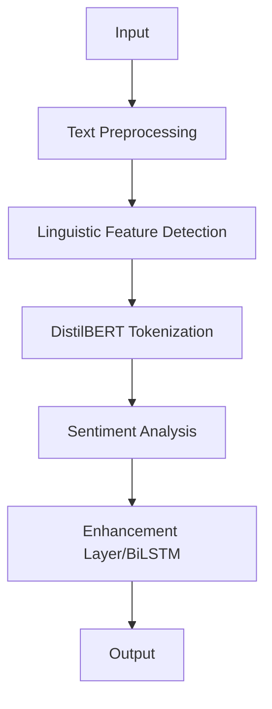

# Sentiment Analysis of Customer Reviews

## Overview

This project implements a sentiment analysis tool for the marketing department to analyze customer product reviews. The system classifies reviews into Positive, Neutral, and Negative categories while handling complex linguistic features including sarcasm, negations, and multipolarity.

## Core Components

### Dataset
- **Source:** Yelp Review Dataset
- **Features:**
  - Large-scale authentic user reviews
  - Easy sentiment mapping with ratings (0-4)
  - Minimal preprocessing requirements

### Tokenizer
`DistilBertTokenizer` is used for:
- Preserving contextual information and semantic relationships
- Handling out-of-vocabulary words through sub-word tokenization

### Model Architecture

#### Base Model: DistilBERT
```python
# Lightweight BERT variant
- 40% smaller, 97% performance
- Optimized for sentiment classification tasks
```

#### Bidirectional LSTM Layer
```python
# Enhanced sequential pattern recognition
- Improves model's ability to understand context
- Better handling of sequential patterns in reviews
```

### Validation Process

| Component | Details |
|-----------|----------|
| Data Management | Training: 80%, Validation: 20% |
| Performance Monitoring | Loss tracking, Early stopping, Dynamic learning rate |
| Quality Assurance | Accuracy, Precision, F1-Score |

### Technical Stack

```python
# Framework
TensorFlow/Keras:
- Robust deep learning framework
- Efficient model deployment

# Key Libraries
- Hugging Face Transformers  # transformer implementation
- NumPy                      # numerical computations
- Pandas                     # data manipulation
```

## Project Architecture


